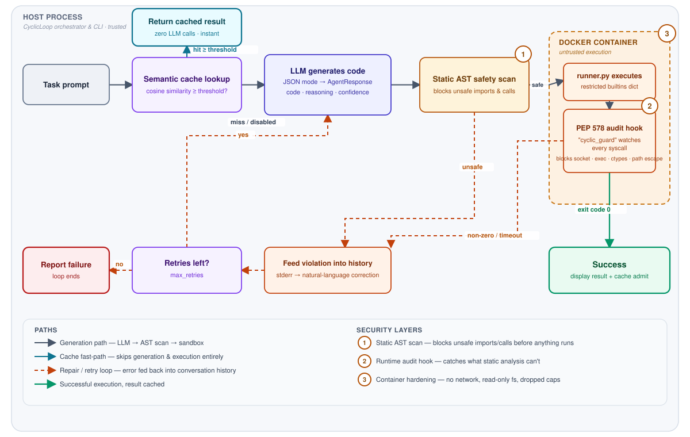

# Cyclic

**A self-healing code-execution agent with a semantic cache and defense-in-depth sandboxing.**

Cyclic takes a natural-language task, asks an LLM to write Python for it, and runs that code in a
hardened, network-isolated Docker sandbox. If the code fails, the error is fed straight back into
the model's context and it tries again — up to a configurable number of retries — so the agent
"heals" its own mistakes instead of just reporting them. A semantic cache sits in front of
generation so semantically similar tasks are served from a previous successful run instead of
paying for another round-trip to the LLM.

The interesting engineering is less about the LLM call and more about everything around it: an AST
static analyzer that rejects unsafe code before it ever runs, a Python interpreter running inside
the sandboxed container with [PEP 578](https://peps.python.org/pep-0578/) audit hooks watching
every syscall-adjacent operation, and a container profile locked down on network, filesystem,
capabilities, and resources. Treat any code an LLM writes as untrusted input — Cyclic is built
around that assumption.

## How it works

<picture>
  <source media="(prefers-color-scheme: dark)" srcset="docs/assets/architecture-dark.svg">
  
</picture>

**Walkthrough:** `CyclicLoop.run()` (`cyclic/main.py`) first checks the `SemanticCache` for a
prompt whose embedding is close enough to the current one; on a hit it replays the cached code and
output immediately with zero LLM calls. On a miss, `Agent.generate()` (`cyclic/agent.py`) calls the
configured LLM through LiteLLM in JSON mode and validates the response into a Pydantic
`AgentResponse` (`code`, `reasoning`, `confidence`). `DockerSandbox.run()` (`cyclic/sandbox.py`)
first runs the code through the static `SafetyScanner` (`cyclic/safety.py`); if that passes, it
launches a locked-down container that executes the code via `runner.py`, which installs a PEP 578
audit hook before running anything. If the container exits non-zero (or times out), the stderr is
turned into a natural-language correction and appended to the conversation history, and the loop
retries with the model now aware of exactly what went wrong. A successful run is written to the
cache (keyed off the *original* prompt, not the retry-adjusted one) so the next semantically similar
request skips generation and execution entirely.

| File | Role |
|---|---|
| `cyclic/main.py` | `CyclicLoop` orchestrator and the Typer CLI (`cyclic run`, `cyclic cache stats/clear`) |
| `cyclic/agent.py` | `Agent` — LiteLLM wrapper that turns a prompt + history into a validated `AgentResponse` |
| `cyclic/safety.py` | `SafetyScanner` — AST walk that blocks dangerous imports/calls before anything executes |
| `cyclic/sandbox.py` | `DockerSandbox` — builds/runs the hardened container and normalizes results into `ExecutionResult` |
| `cyclic/runner.py` | In-container entrypoint; installs the PEP 578 `cyclic_guard` audit hook and executes the payload with a restricted builtins dict |
| `cyclic/cache.py` | `SemanticCache` — LiteLLM embeddings + ChromaDB similarity search, store/search/clear/stats |

## Security model

The security posture is layered so that no single check has to be perfect — each layer assumes the
one before it can be bypassed.

**1. Static AST scan (`cyclic/safety.py`)** — before any code is sent to the sandbox, it's parsed
into an AST and walked by `SafetyScanner`. It rejects:
- Imports (including `import x.y` submodules and `from x import y`) of `os`, `subprocess`, `sys`,
  `socket`, `shutil`, `importlib`
- Calls to `eval`, `exec`, `__import__`

This is a cheap, fast rejection of the obvious cases. It's explicitly *not* trusted to be
sufficient on its own — `open()` is deliberately allowed at this layer because the runtime hook
below is what actually governs file access.

**2. Runtime PEP 578 audit hook (`cyclic/runner.py`)** — the code that survives the static scan
still runs inside the container under a `sys.addaudithook` callback (`cyclic_guard`) that fires on
every audited CPython event, catching things static analysis can't (e.g. `getattr(os, "sys"+"tem")`
dodging the AST import check). It blocks:
- Any `socket.*` event (all networking, regardless of how the socket module was reached)
- Process creation: `os.system`, `os.spawn*`, `subprocess.Popen`
- Dynamic library loading: `ctypes.dlopen`
- File access outside of `/tmp` and the interpreter's own standard-library prefixes — paths are
  `os.path.normpath`'d first so `/tmp/../etc/passwd`-style traversal doesn't slip through

Execution itself runs against a restricted builtins dict (`create_safe_globals`) rather than the
full builtin namespace.

**3. Container hardening (`cyclic/sandbox.py`)** — even if code executes, the container it runs in
is boxed in on every axis Docker exposes:
- `network_disabled=True` — no network interface at all
- `read_only=True` root filesystem, with only a `tmpfs` `/tmp` writable
- Runs as `65534:65534` (`nobody`), not root
- `cap_drop=["ALL"]` — every Linux capability removed
- `mem_limit="128m"` and a CPU quota (`cpu_period`/`cpu_quota` = 100000/100000, i.e. one CPU)
- A hard execution `timeout` (default 10s, `container.wait(timeout=...)`) that maps to exit code
  `124` and gets reported back to the model as "execution timed out"

Code and results cross the container boundary only through an environment variable
(`CYCLIC_CODE_PAYLOAD`) in and combined stdout/stderr logs out — no shared volumes beyond the
read-only mount of `runner.py` itself.

**Adversarial testing:** `tests/test_jailbreak.py` exercises these layers directly — obfuscated
`os.system` calls, reads of `/etc/passwd`, raw socket connections, `subprocess.Popen` — verifying
each is stopped at the layer it's supposed to be stopped at (and that legitimate stdlib imports and
`/tmp` file access keep working).

## Semantic cache

`SemanticCache` (`cyclic/cache.py`) avoids re-generating and re-executing code for tasks that are
semantically the same as one already solved:

- The prompt is embedded via LiteLLM (`aembedding`, default model `text-embedding-3-small`) and
  looked up in a ChromaDB collection (cosine distance space) persisted to `~/.cyclic/cache/`.
- A hit requires cosine similarity ≥ the configured threshold (default **0.85**); on a hit, the
  cached code, reasoning, confidence, and execution result are returned without another LLM call.
- On a successful run (`exit_code == 0`), the prompt embedding, generated code, reasoning,
  confidence, and stdout/stderr are upserted into the cache, keyed by a deterministic hash of
  `(prompt, code, embedding_model)`.
- Raw prompts are *not* persisted in cache metadata by default (`store_prompt=False`) — only a
  SHA-256 of the prompt is kept, though the prompt text is still sent to the embedding provider on
  every read/write.
- Collections are versioned by schema and embedding model, so switching embedding models doesn't
  silently mix incompatible vectors.

CLI surface:
```bash
uv run cyclic cache stats   # entry count, on-disk size, cache directory
uv run cyclic cache clear   # wipe all cached entries
```

Relevant `cyclic run` flags:
- `--cache/--no-cache` — enable/disable the cache for this run (default: **enabled**)
- `--cache-threshold <float>` — similarity threshold, 0.0–1.0 (default: **0.85**)

If cache initialization or an embedding call fails (e.g. no API key, ChromaDB unavailable), Cyclic
logs a warning and falls back to normal generation rather than failing the run.

## Quickstart

**Requirements**
- Python 3.12 (pinned via `requires-python = ">=3.12,<3.13"`)
- [uv](https://github.com/astral-sh/uv)
- Docker (the sandbox is a hard dependency — code never runs on the host)
- An LLM API key: `LITELLM_API_KEY` or `OPENAI_API_KEY`

**Setup**
```bash
uv sync
```

**Run the self-healing loop**
```bash
uv run cyclic run "write a fizzbuzz script"
```

**Options**
| Flag | Default | Meaning |
|---|---|---|
| `--model`, `-m` | `gpt-4o-mini` | LiteLLM model identifier for code generation |
| `--max-retries`, `-r` | `3` | Maximum generate/execute attempts before giving up |
| `--timeout`, `-t` | `10` | Per-execution timeout in seconds |
| `--verbose`, `-v` | off | Print generated code, reasoning/confidence, and error detail per attempt |
| `--cache/--no-cache` | cache enabled | Toggle the semantic cache for this run |
| `--cache-threshold` | `0.85` | Cosine similarity threshold for a cache hit |

Example with a non-default model and verbose output:
```bash
uv run cyclic run "parse a CSV and print the column with the highest sum" \
  --model gpt-4o --max-retries 5 --timeout 20 --verbose
```

Representative output on success:
```
Cyclic: Self-Healing Code Execution
Prompt: write a fizzbuzz script

✓ Success!

Generated Code:
for i in range(1, 16):
    ...

Output:
1
2
Fizz
...

Completed in 1 attempt(s)
```

## Testing

Cache unit tests (mocked embeddings, no Docker required):
```bash
uv run --python 3.12 pytest tests/test_cache.py -v
```

Docker-based security/jailbreak suite (spins up real containers, needs a running Docker daemon):
```bash
uv run --python 3.12 pytest tests/test_jailbreak.py -v
```

## Roadmap

- **Real success verification beyond exit-code-0** — an exit code of 0 doesn't mean the code did
  the right thing; add output/behavior-based verification.
- **Evaluation harness** — pass@1 and pass-after-repair benchmarks to actually measure how much the
  retry loop helps, and to catch regressions in the agent or safety layers.
- **Observability & cost tracing** — structured tracing of tokens, latency, and $ per run across
  generation, cache lookups, and retries.
- **Failure-memory retrieval** — surface prior failures (and their fixes) for similar prompts back
  into the repair prompt, not just the current run's own history.
- **CI** — automated test runs (including the Docker-based jailbreak suite) on every push/PR.

## License

MIT — see [LICENSE](LICENSE).
