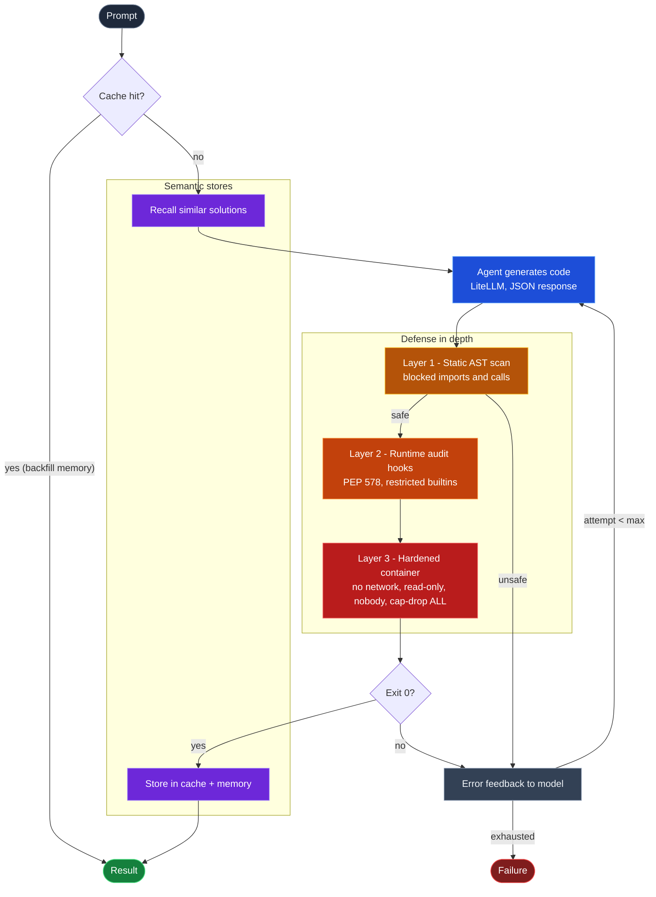

# Cyclic

Cyclic is a self-healing code-execution agent. An LLM writes Python for a
task, a hardened sandbox actually runs it, and if it fails, the error goes
back to the model as feedback for the next attempt, up to a configurable
retry limit. Successful (prompt, code) pairs are recalled semantically on
future runs, so the agent gets few-shot context from what already worked
instead of starting cold every time. There's also an optional semantic
cache that can skip generation entirely on a near-duplicate prompt.

## Architecture



Notes on control flow (from `cyclic/main.py`):

- The semantic cache is checked once, before generation, and only on the
  first attempt. A hit returns immediately with `attempts=0` and skips the
  agent, scanner, and sandbox entirely.
- Memory recall also happens once, before the retry loop starts. If a
  similar past solution exists, its problem/solution text is prepended to
  the prompt as a reference block, but only on attempt 1. Retries use the
  error-feedback prompt instead.
- On a fresh success, the solution is stored in both the cache and memory.
  A cache hit only backfills memory, since the code already came from the
  cache.
- On failure, `stderr` (or a timeout/exit-code message) becomes the next
  prompt: `"Previous attempt failed: {error}. Please fix the code."`, and
  the loop retries until `max_retries` is exhausted.

## Quickstart

Prerequisites:

- Docker running locally (the sandbox shells out to the Docker daemon).
- Python 3.12 (the project pins `>=3.12,<3.13`) via `mise` or `uv`.
- An LLM API key.

```bash
uv sync
export OPENAI_API_KEY=sk-...        # or LITELLM_API_KEY
uv run cyclic run "print the first 10 primes" -v
```

## CLI reference

### `cyclic run PROMPT [OPTIONS]`

| Flag | Default | Description |
|---|---|---|
| `PROMPT` (argument) | required | Task description for code generation |
| `--model`, `-m` | `gpt-4o-mini` | LLM model to use |
| `--max-retries`, `-r` | `3` | Maximum retry attempts |
| `--timeout`, `-t` | `10` | Execution timeout in seconds |
| `--verbose`, `-v` | off | Show detailed output |
| `--cache` / `--no-cache` | cache enabled | Enable semantic cache |
| `--cache-threshold` | `0.85` | Cache similarity threshold (0.0-1.0) |
| `--no-memory` | off (memory enabled) | Disable solution memory |

### Cache management

| Command | Description |
|---|---|
| `cyclic cache stats` | Show cache statistics (entry count, size on disk, cache directory) |
| `cyclic cache clear` | Clear the semantic cache |

Cache data lives at `~/.cyclic/cache/` by default.

### Memory management

| Command | Description |
|---|---|
| `cyclic memory stats` | Show number of stored solutions |
| `cyclic memory clear` | Clear all stored solutions |

## Security model

Cyclic runs LLM-generated code, which is untrusted by construction: the
model can hallucinate, be prompted adversarially, or just get talked into
something dangerous by a misleading task description. No single layer here
is trusted to hold on its own; each is built assuming the layer in front of
it might be bypassed. The three layers, in order of execution:

### Layer 1: static AST scan (`cyclic/safety.py`)

Before any code touches Docker, `scan_code()` parses it into an AST and
walks it looking for two things:

- **Blocked imports** (both `import x` and `from x import y`, including
  submodules like `os.path`): `os`, `subprocess`, `sys`, `socket`,
  `shutil`, `importlib`.
- **Blocked calls** to bare names: `eval`, `exec`, `__import__`.

Note that `open` is deliberately *not* blocked at this layer: the comment
in the source is explicit that runtime audit hooks are responsible for
restricting file access, not the scanner. Any `SyntaxError` during parsing
is also treated as unsafe.

This layer is cheap and fast, but it is purely lexical: it matches import
statements and direct name calls, not behavior. It's trivially defeated by
indirection: for example, `getattr(os, 'sys' + 'tem')` still requires
importing `os`, which the scanner does catch, but a call built through
`getattr` instead of a literal `os.system(...)` reference would sail past
the call-name check even if the import weren't blocked. That gap is exactly
why execution never relies on the scanner alone: it's a fast reject for
obviously hostile code, not a security boundary.

### Layer 2: runtime PEP 578 audit hooks (`cyclic/runner.py`)

Code that passes the static scan runs inside the container via `runner.py`,
which registers a `sys.addaudithook` callback (`cyclic_guard`) before
executing anything. The hook inspects every audited event as it happens,
raising `SecurityError` (caught in `runner.py` and turned into a
`Security Violation` message on stderr with exit code 1) for:

- **Networking**: any event whose name starts with `socket.`.
- **Process spawning**: `os.system`, `os.spawn`, `os.spawnve`, `os.spawnv`,
  `os.spawnvp`, `os.spawnvpe`, `os.exec`, `os.posix_spawn`, `os.fork`, and
  `subprocess.Popen`.
- **Dynamic library loading**: `ctypes.dlopen`.
- **File opens** (`open` event): integer file descriptors are always
  allowed (needed for normal stdio); string paths are normalized with
  `os.path.normpath` to defeat traversal tricks like
  `/tmp/../etc/passwd`, then allowed only if the normalized path is `/tmp`
  or starts with `/tmp/`, or starts with `sys.base_prefix` /
  `sys.base_exec_prefix` (so the interpreter can read its own standard
  library). Everything else is rejected.

On top of the audit hook, `create_safe_globals()` builds a `__builtins__`
dict from the full set of Python builtins, minus a small denylist
(`eval`, `exec`, `compile`, `input`, `breakpoint`). Executed code still has
everything else, including `__import__`, `getattr`, `open` (governed by the
hook above), and every ordinary type and exception. This is friction against
dynamic code execution rather than a boundary: it does not stop code from
reaching dangerous functionality through other means. Actual containment
comes from the audit hook below and the container around it.

This is the layer that actually stops the obfuscation case Layer 1 can
miss: even if a call to a dangerous function is built dynamically and
evades the AST scanner, the audit hook still observes the underlying
syscall-level event (`os.system`, `socket.*`, etc.) at the moment it fires,
regardless of how the reference to it was constructed. Coverage is only as
good as the event blocklist, though: the hook checks `os.system`, the
`os.spawn*` family, `os.exec`, `os.posix_spawn`, `os.fork`, and
`subprocess.Popen`, so exec/fork-based process creation is caught at this
layer as well, not just by the import ban and the container.

### Layer 3: container hardening (`cyclic/sandbox.py`)

Even if code somehow made it past both static and runtime checks, it still
executes inside a Docker container launched with:

- `network_disabled=True`: no external network attachment. The container
  gets an isolated network namespace with only a loopback interface, and
  the `socket.*` audit hook blocks even loopback use from inside.
- `read_only=True`: the root filesystem is mounted read-only.
- `tmpfs={'/tmp': ''}`: `/tmp` is the only writable location, backed by
  tmpfs (memory-backed, discarded with the container).
- `user="65534:65534"`: runs as `nobody`, not root.
- `cap_drop=['ALL']`: every Linux capability is dropped.
- `mem_limit="128m"`, `cpu_period=100000`, `cpu_quota=100000`: capped at
  128 MB of memory and effectively one CPU.
- `runner.py` is bind-mounted read-only at `/runner.py`; the generated code
  itself is passed in via the `CYCLIC_CODE_PAYLOAD` environment variable
  rather than a file, avoiding a stdin race and keeping the payload out of
  the writable filesystem.
- The container is waited on with a timeout (`container.wait(timeout=...)`);
  a timeout is reported as exit code `124` and the container is force
  -removed in a `finally` block regardless of outcome.

Even a full jailbreak of the Python-level sandbox (layers 1 and 2) lands
inside a container with no network, no writable root filesystem, no
capabilities, and a memory/CPU ceiling. There's very little left to do
with arbitrary code execution at that point.

### Jailbreak test coverage

`tests/test_jailbreak.py` exercises these layers directly against a real
Docker sandbox. A few of the concrete attempts it covers:

- **Obfuscated `os.system`**: `func = getattr(os, 'sys' + 'tem')` then
  `func('echo hacked')`. Still blocked, but by Layer 1 (the `import os`
  itself is caught by the static scanner) rather than by defeating the
  `getattr` indirection at the call-name level.
- **Reading `/etc/passwd`** via plain `open('/etc/passwd', 'r')`: no
  disallowed import at all, so this is caught purely by the Layer 2 audit
  hook's path-prefix check.
- **Raw socket connection** (`socket.socket(...).connect(...)`) and
  **`subprocess.Popen`**: both caught at Layer 1 via their imports.

The same suite also asserts the sandbox isn't overly restrictive: writing
and reading back a file under `/tmp` succeeds, and standard-library
imports like `heapq`, `collections`, and `math` work normally.

## Memory

`cyclic/memory.py` gives the agent semantic recall of its own past
successes, backed by a local ChromaDB collection (`solutions`, cosine
distance) embedded with ChromaDB's default local embedding function: no
external embedding API call, unlike the semantic cache.

- On every successful run, `Memory.remember()` embeds the prompt and stores
  the code, reasoning, and a UTC timestamp, keyed by a deterministic hash
  of `(prompt, code)` so repeated identical solutions upsert in place
  rather than duplicating.
- Before generation starts, `Memory.recall_context()` fetches up to 3
  similar past solutions and, if any clear the similarity floor
  (`min_similarity`, default `0.45`), renders them into a reference block
  injected as a prefix on the *first* generation attempt only. It's not
  part of the retry-feedback prompt.
- Data lives at `~/.cyclic/memory` by default.
- **Privacy default**: the raw prompt text is *not* persisted; only a
  SHA-256 hash of it (`prompt_sha256`) is stored alongside the code and
  reasoning, unless `store_prompt=True` is set explicitly. (The CLI does
  not currently expose a flag to turn this on; it's a constructor
  argument.)
- Opt out per run with `--no-memory`.
- Wipe everything with `cyclic memory clear` (drops and recreates the
  `solutions` collection); check what's stored with `cyclic memory stats`.

## Development

```bash
uv sync
uv run pytest          # requires Docker running (sandbox/jailbreak tests spin up real containers)
uv run ruff check .
uv run ruff format .
```

CI runs the same `pytest` and `ruff` checks on every pull request.

Note: litellm's dependencies currently emit a Pydantic deprecation warning
on import. It's upstream and harmless.
